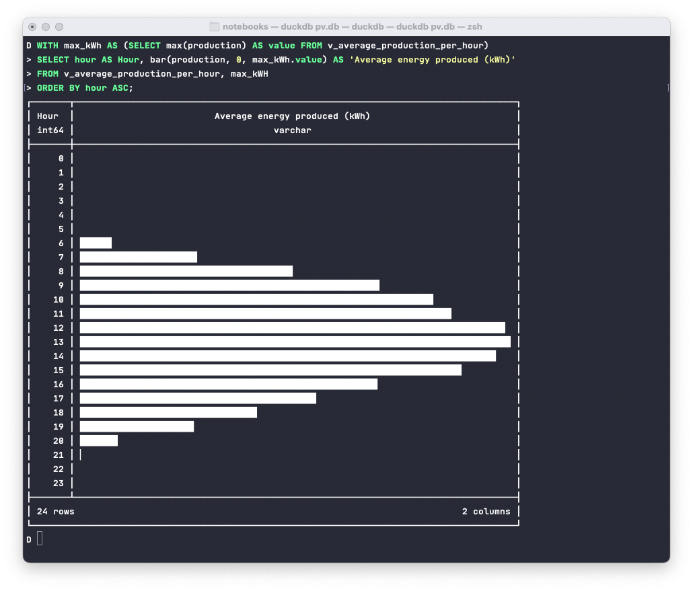

# pv

⚠️ Programs and scripts in this repository are not meant to be used and may damage your equipment (Of course I use them myself but you never know with expensive equiptment).

## Requirements

### For the power logger

The logger is based on the [Energy systems reading toolkit](https://energy.basjes.nl). Thanks a ton for your work, [Niels Basjes](https://mastodon.basjes.nl/@niels). 

Build the power logger with

```bash
mvn -f logger/pom.xml clean package
```

### For the database

[DuckDB](https://duckdb.org) >= 0.8.0.

The schema is kind of separated in non-repeatable migrations and repeatable migrations. 
In reality, the non-repeatable ones are idempotent, too, at least at the moment. 
All schema scripts starts with an uppercase `V` followed by an incrementing number contain tables and the like.
All statistics work with views. Those are named with an uppercase `R` to indicate that the contained statements are always repeatable:

The schema can be applied as follows:

```bash
./bin/migrate.sh pv.db
```

Measurements are stored per quarterly hour, as local date times (local timezone is assumed). 
For dealing with specifics to your area, i.e. changes during summer / winter time observations, scripts needs adjustment.
All views - think of them as public API to this database - start with an `v_`.

### For the Jupyter notebook

I have added a `requirements.txt` usable with `pip` like this:

```bash
pip install -r notebooks/requirements.txt
```

## Usage

### Logger

Run the power logger with:

```bash
./logger/target/assembly/bin/log-power-output
```

Again, this might damage your inverter, burn down the house and what not. Use at your own risk. The logger puts out 1 minute measurements in watt (W) by default which can be imported after creating a database file as described above like this:

```bash
more logger.csv | duckdb pv.db -c ".read attic/import_logger.sql"
```

### Jupyter Notebook

Run the notebook with:

```bash
jupyter notebook notebooks/Photovoltaik\ \|\ Familie\ Simons,\ Aachen.ipynb
```

Produce HTML without input boxes and code:

```bash
jupyter nbconvert --execute --to html --output index.html --no-input notebooks/Photovoltaik\ \|\ Familie\ Simons,\ Aachen.ipynb
```

Clear existing output with:

```bash
jupyter nbconvert --ClearOutputPreprocessor.enabled=True --inplace notebooks/Photovoltaik\ \|\ Familie\ Simons,\ Aachen.ipynb
```

I have a rendered version with my current dataset at [simons.ac/pv](http://simons.ac/pv).

### Database

#### Examples

You can get a list of all views to explorer directly from the information schema like this:

```bash
duckdb --readonly pv.db "SELECT table_name FROM information_schema.tables WHERE table_type = 'VIEW' ORDER BY table_name ASC"
```

Their titles should hopefully be self-explanatory, and I only want to show two highlights here. 
The `bar` function and the pivot support. The following adds a bit to the view named `v_average_production_per_month` and produces a quick chart in the terminal, showing the average energy produced per hour:

```bash
duckdb --readonly notebooks/pv.db <<-SQL
WITH max_kWh AS (SELECT max(production) AS value FROM v_average_production_per_hour)
SELECT hour AS Hour, bar(production, 0, max_kWh.value) AS 'Average energy produced (kWh)'
FROM v_average_production_per_hour, max_kWH
ORDER BY hour ASC;
SQL
```

Should look something like this, which I totally love:



Of course this is also possible per month:

```bash
duckdb --readonly notebooks/pv.db <<-SQL
WITH max_kWH AS (SELECT max(production) AS value FROM v_average_production_per_month)
SELECT month AS Month, 
     bar(production, 0, max_kWH.value) AS 'Average energy produced (kWh)'
FROM v_average_production_per_month, max_kWH
ORDER BY month ASC;
SQL
```

Then there is the `PIVOT` statement being used in `v_average_production_per_month_and_hour` view to compute the average per
hour _and_ month. Originally I displayed the month names as headers, but that is not that useful as an API for the database when you want todo the translation later:

```bash
duckdb --readonly notebooks/pv.db "SELECT * FROM v_average_production_per_month_and_hour"
```


#### Creating backups

The whole database can be exported either as CSV files like this

```sql
EXPORT DATABASE 'target_folder';
```

Or if you prefer [Parquet](https://parquet.apache.org), use the following:

```sql
EXPORT DATABASE 'target_folder' (FORMAT PARQUET, COMPRESSION ZSTD);
```
